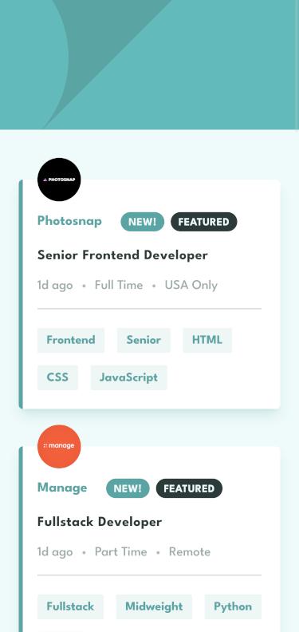

# Frontend Mentor - Job listings with filtering solution

This is a solution to the [Job listings with filtering challenge on Frontend Mentor](https://www.frontendmentor.io/challenges/job-listings-with-filtering-ivstIPCt).

## Table of contents

- [Overview](#overview)
  - [The challenge](#the-challenge)
  - [Screenshot](#screenshot)
  - [Links](#links)
- [My process](#my-process)
  - [Built with](#built-with)
  - [What I learned](#what-i-learned)
- [Author](#author)

## Overview

### The challenge

Users should be able to:

- View the optimal layout for the site depending on their device's screen size
- See hover states for all interactive elements on the page
- Filter job listings based on the categories

### Screenshot




### Links

- Solution URL: [Project Solution](https://www.frontendmentor.io/solutions/responsive-job-filtering-app-w-sveltekit-tailwindcss-typescript-BFlgGmrwrG)
- Live Site URL: [Project live site](https://job-listings-with-filtering-seven.vercel.app/)

## My process

### Built with

- Semantic HTML5 markup
- Flexbox
- Mobile-first workflow
- [SvelteKit](https://kit.svelte.dev/) - JS framework
- [TailwindCss](https://tailwindcss.com/) - Utility-first CSS framework
- [Typescript](https://www.typescriptlang.org/) - Strongly typed JS

### What I learned

#### Filter function

```js
jobs.update((_) => {
  if (filters.length === 0) {
    return JOBS;
  } else {
    return JOBS.filter((job) => {
      const jobFilters = [job.role, job.level, ...job.languages, ...job.tools];
      let condition = true;
      for (let i = 0; i < filters.length; i++) {
        const filter = filters[i];
        if (!jobFilters.includes(filter)) {
          condition = false;
          break;
        }
      }
      return condition;
    });
  }
});
```

#### Toggle a class with Svelte **class:** attributes

```js
<button
  on:click={() => type === "add" && addFilter(label)}
  aria-label="Add {label} to filters"
  type="button"
  class:cursor-default={type === "remove"}
  class:tag-hover={type === "add"}
  class="bg-neutral-200 px-3 py-2 text-primary">
  {label}
</button>
```

## Author

- Frontend Mentor - [@AntoineC-dev](https://www.frontendmentor.io/profile/AntoineC-dev)
